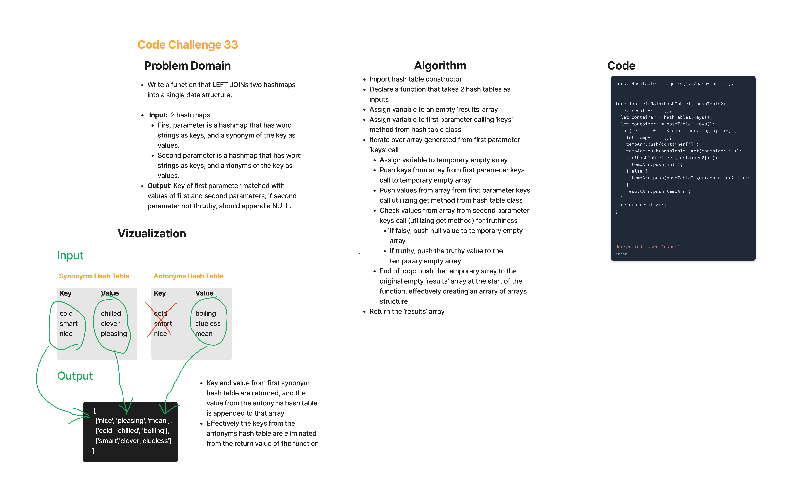

# Hashmap Left Join -- Code Challenge 33

## Feature Tasks

* Write a function that LEFT JOINs two hashmaps into a single data structure.

* Write a function called left join
  * Arguments: two hash maps
    * The first parameter is a hashmap that has word strings as keys, and a synonym of the key as values.
    * The second parameter is a hashmap that has word strings as keys, and antonyms of the key as values.
  * Return: The returned data structure that holds the results is up to you. It doesn’t need to exactly match the output below, so long as it achieves the LEFT JOIN logic

## Whiteboard Process

## Approach & Efficiency

* The full coding challenge took approximately 3 hours to complete, including white boarding, and writing the actual code for the solution and the testing.
* Time: O(n) -- worst case dependent on traversing hash tables, which is of course dependent on size of the tables.
* Space: O(n) -- dependent on hash table size inputs.

## Solution

    const ht3 = new HashTable();
    const ht4 = new HashTable();

    ht3.set('smart', 'clever');
    ht3.set('nice', 'pleasing');
    ht3.set('cold', 'chilled');
    ht4.set('smart', 'clueless');
    ht4.set('nice', 'mean');
    ht4.set('cold', 'boiling');

* console.log(leftJoin(ht3, ht41));
  * // returns [ ['nice', 'pleasing', 'mean'], ['cold', 'chilled', 'boiling'], ['smart','clever','clueless'] ]
