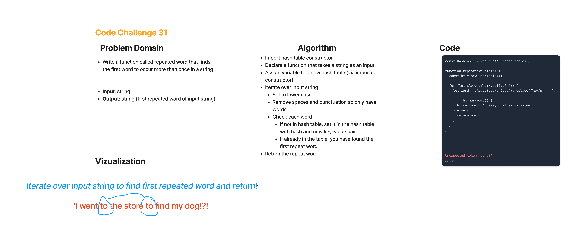

# Hash Map-Repeated Word -- Code Challenge 31

## Feature Tasks

* Write a function called repeated word that finds the first word to occur more than once in a string

  * Arguments: string
  * Return: string

## Whiteboard Process

## Approach & Efficiency

* The full coding challenge took approximately 3 hours to complete, including white boarding, and writing the actual code for the solution and the testing.
* Time: O(n) -- worst case dependent on iterating over entire string, which is of course dependent on size of string.
* Space: O(n) -- dependent on string size inputs.

## Solution

* let string1 = 'I went to the store to find my dog!?!';
* let string2 = 'My cats run wild through the forest and run, and run and run...';
* let string3 = 'In the morning I walked down the Boulevard to the rue Soufflot for coffee and brioche. It was a fine morning. The horse-chestnut trees in the Luxembourg gardens were in bloom. There was the pleasant early-morning feeling of a hot day. I read the papers with the coffee and then smoked a cigarette. The flower-women were coming up from the market and arranging their daily stock. Students went by going up to the law school, or down to the Sorbonne. The Boulevard was busy with trams and people going to work.';

* console.log(repeatedWord(string1)); // returns to
* console.log(repeatedWord(string2)); // returns run
* console.log(repeatedWord(string3)); // returns the
