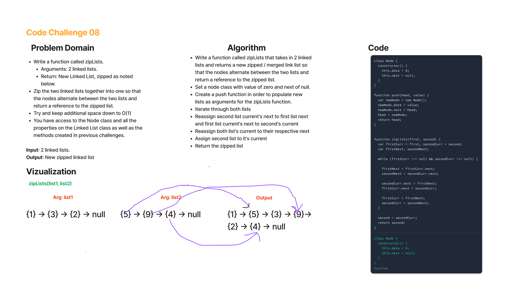

# Zip Linked Lists -- Code Challenge 08

Zip two linked lists.

## Code Challenge 08

* Write a function called zip lists.
  * Arguments: 2 linked lists.
  * Return: New Linked List, zipped as noted below.
* Zip the two linked lists together into one so that the nodes alternate between the two lists and return a reference to the the zipped list.
* Try and keep additional space down to O(1)
* You have access to the Node class and all the properties on the Linked List class as well as the methods created in previous challenges.

## Whiteboard Process

## Approach & Efficiency

* The full coding challenge took approximately 7 hours to complete, including white board, and writing the actual code for the solution and the testing.
* Time: 0(min(n1, n2)), where n1 and n2 represent the respective lengths of the 2 lists.
* Space: O(1), because no extra space is required, i.e fixed.

## Solution

* let first = null, second = null;
* first = push(first, 3);
* first = push(first, 2);
* first = push(first, 1);
* console.log('first', JSON.stringify(first));
  * //first {"data":1,"next":{"data":2,"next":{"data":3,"next":null}}}

* second = push(second, 8);
* second = push(second, 7);
* second = push(second, 6);
* second = push(second, 5);
* second = push(second, 4);
* console.log('second', JSON.stringify(second));
  * //second {"data":4,"next":{"data":5,"next":{"data":6,"next":{"data":7,"next":{"data":8,"next":null}}}}}

* second = zipLists(first, second);
* console.log('first post-merge', JSON.stringify(first));
  * //first post-merge {"data":1,"next":{"data":4,"next":{"data":2,"next":{"data":5,"next":{"data":3,"next":{"data":6,"next":null}}}}}}
* console.log('second post-merge', JSON.stringify(second));
  * //second post-merge {"data":7,"next":{"data":8,"next":null}}
