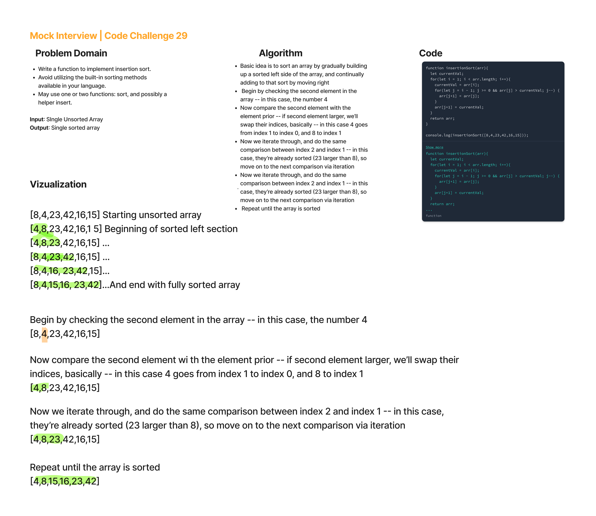

# Insertion Sort -- Code Challenge 26

## Reflections

* I read up on the problem online and tried to understand the problem.
* The solution is easy to understand conceptually, effectively you're gradually sorting an array from left to right, and continue through until the entire array is sorted.
* Of course, understanding concepts is nice, but actually putting it into working code is another thing.
* The solution I understood best utilized nested for loops in a clever way, effectively an outer loop going left to right and an inner loop decrementing and going 'backwards'.
* Like all of these problems, I am curious about other ways to solve the problem.
* I had some experience with javascript (matter of months) prior to Code Fellows but almost all of the DSA challenges REALLY are challenges for me, i.e. when I see a solution out there, I'm not kicking myself for missing it -- I'm thinking, 'that's clever, and that would have taken me all day to do on my own...'
* All of the sorting challenges this week have been quite challenging, but good to be introduced to their basic structures.

