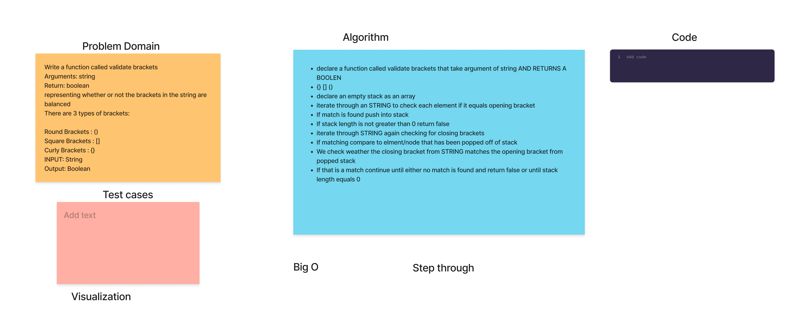

# Stacks, Queues and Brackets -- Code Challenge 13

Multi-bracket Validation

## Code Challenge 13

Write a function called validate brackets

* Arguments: string
* Return: boolean
  * representing whether or not the brackets in the string are balanced

There are 3 types of brackets:

* Round Brackets : ()
* Square Brackets : []
* Curly Brackets : {}

## Whiteboard Process

## Approach & Efficiency

* The full coding challenge took approximately 3 hours to complete, including white board partner session, and writing the actual code for the solution and the testing.
* Time: O(N), Iteration over the string of size N one time.
* Space: O(N) for stack.

## Solution

let string = '([{}])';
let string2 = '{}{Code}[Fellows](())';
let string3 = '[({}]';

console.log(validateBrackets(string)); // returns true
console.log(validateBrackets(string2)); // returns true
console.log(validateBrackets(string3)); // returns false
