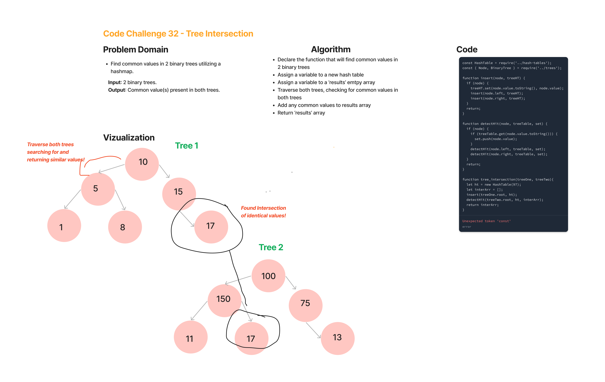

# Tree Intersection -- Code Challenge 32

Find common values in 2 binary trees.

## Feature Tasks

* Write a function called tree_intersection that takes two binary trees as parameters.
* Using your Hashmap implementation as a part of your algorithm, return a set of values found in both trees.

## Whiteboard Process

## Approach & Efficiency

* The full coding challenge took approximately 5 hours to complete, including white board session, and writing the actual code for the solution and the testing.
* Time: O(n) -- traversals of trees will inevitably be dependent on the size of the trees, i.e. the longer the trees, longer the traversal.
* Space: O(n) -- the bigger the trees, the more space will be necessary.

## Solution

let tree1 = new BinaryTree();
tree1.root = new Node(10);
tree1.root.left = new Node(5);
tree1.root.right = new Node(15);
tree1.root.left.left = new Node(1);
tree1.root.left.right = new Node(8);
tree1.root.right.right = new Node(17);

let tree2 = new BinaryTree();
tree2.root = new Node(30);
tree2.root.left = new Node(5);
tree2.root.right = new Node(15);
tree2.root.left.left = new Node(2);
tree2.root.left.right = new Node(9);
tree2.root.right.right = new Node(18);

console.log('Tree intersection: ', tree_intersection(tree1, tree2)); // expect [5, 15] to be returned
