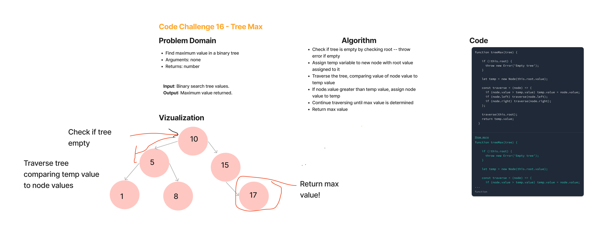

# Tree Max -- Code Challenge 16

Tree-max

## Feature Tasks

Write the following method for the Binary Tree class

    * Find maximum value
    * Arguments: none
    * Returns: number
    * Find the maximum value stored in the tree.
        * You can assume that the values stored in the Binary Tree will be numeric.

## Whiteboard Process

## Approach & Efficiency

* The full coding challenge took approximately 3 hours to complete, including white board, and writing the actual code for the solution and the testing.
* Time: O(n).
* Space: O(1).

## Solution

* console.log('treeMax', tree.treeMax()); // treeMax expect 17
